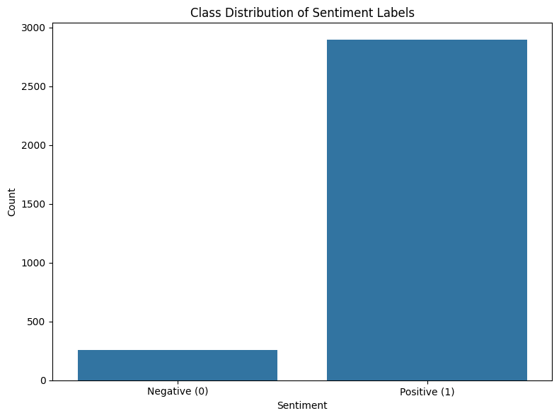
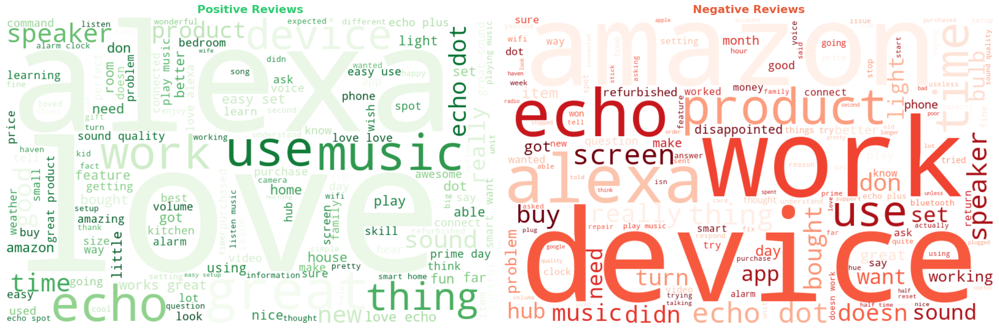
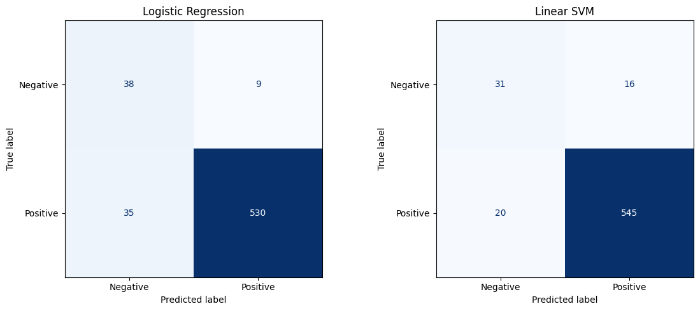
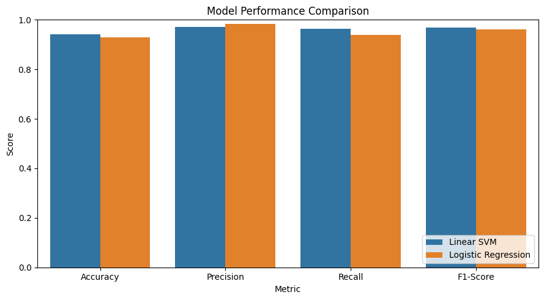

# 💬 Amazon Review Sentiment Dashboard

An end-to-end NLP project that classifies Amazon product reviews as **positive** or **negative**, and serves the trained model through an interactive **Streamlit** web app.

Type in any review and get an instant predicted sentiment along with a confidence score — powered by a TF-IDF + machine learning pipeline trained on real customer review data.

---

## 📌 Overview

This project covers the full pipeline of a text classification task:

- Cleaning and preprocessing raw, noisy review text
- Exploratory analysis of sentiment class distribution
- Visualizing the most frequent words in positive vs. negative reviews
- Feature extraction using TF-IDF vectorization
- Training and comparing multiple classification models
- Evaluating models with standard classification metrics
- Deploying the best-performing model in a live, interactive dashboard

---

## ✨ Features

- **Interactive Sentiment Predictor** — paste any review text and get a real-time prediction with a confidence score
- **Data Overview page** — visualizes class distribution and word clouds for both sentiment classes
- **Model comparison** — evaluates and benchmarks three different ML algorithms side by side
- **Reproducible notebook** — the entire modeling process, from raw CSV to saved model, is documented and executable end to end

---

## 🗂️ Dataset

- **Source:** Amazon product reviews
- **Size:** ~3,150 reviews
- **Columns:**
  | Column | Description |
  |---|---|
  | `rating` | Star rating (1–5) given by the reviewer |
  | `date` | Date the review was posted |
  | `variation` | Product variation/model |
  | `verified_reviews` | Raw review text |
  | `feedback` | Sentiment label — `1` = Positive, `0` = Negative |

The dataset is naturally **imbalanced**, with the large majority of reviews being positive:

<p align="center">
  
</p>

| Sentiment | Count |
|---|---|
| Positive (1) | 2,893 |
| Negative (0) | 257 |

---

## 🧠 Methodology

### 1. Text Cleaning
Raw review text is cleaned before modeling:
- Lowercased
- URLs, HTML tags, and HTML entities stripped
- Non-alphabetic characters removed
- Common English stopwords removed
- Short tokens (≤ 2 characters) discarded

### 2. Word Clouds
Word clouds were generated separately for positive and negative reviews to visually surface the most frequent, distinguishing terms in each class.

<p align="center">
  
</p>

### 3. Feature Extraction — TF-IDF
Cleaned text is converted into numerical features using **TF-IDF (Term Frequency–Inverse Document Frequency)**, capturing both unigrams and bigrams (top 5,000 features). TF-IDF was chosen over simple word counts because it down-weights common, low-information words and emphasizes terms that are more distinctive to a given review — a lightweight and effective choice for short review-style text.

### 4. Model Training
Three classification models were trained on an 80/20 stratified train/test split:

- Logistic Regression (`class_weight='balanced'`)
- Multinomial Naive Bayes
- Linear Support Vector Machine (`class_weight='balanced'`)

### 5. Evaluation
Each model was evaluated using accuracy, precision, recall, and F1-score, along with a confusion matrix.

<p align="center">
  
</p>

### 6. Model Comparison

<p align="center">
  
</p>

| Model | Accuracy | Precision | Recall | F1-Score |
|---|---|---|---|---|
| **Linear SVM** | 0.944 | 0.973 | 0.966 | **0.970** |
| Logistic Regression | 0.933 | 0.987 | 0.940 | 0.963 |


**Linear SVM** was selected as the final model (higher F1-score) and saved along with its fitted TF-IDF vectorizer for use in the dashboard.


---

## 🖥️ Dashboard

The Streamlit app has three pages, accessible from the sidebar:

| Page | Description |
|---|---|
| **Home** | Project introduction and overview |
| **Data Overview** | Class distribution chart and word clouds |
| **Sentiment Predictor** | Enter a review and get an instant sentiment prediction + confidence score |

---

## 🛠️ Tech Stack

- **Python 3**
- **pandas / numpy** — data handling
- **scikit-learn** — TF-IDF vectorization, model training & evaluation
- **matplotlib / seaborn** — plots and charts
- **wordcloud** — word cloud generation
- **joblib** — model serialization
- **Streamlit** — interactive web dashboard

---

## 📁 Project Structure

```
.
├── app.py                  # Streamlit dashboard (Home, Data Overview, Sentiment Predictor)
├── nlp.ipynb               # Full NLP + modeling pipeline notebook
├── data/
│   └── amazon_reviews.csv  # Dataset used for training
├── models/
│   ├── best_model.pkl          # Saved best-performing classifier (Linear SVM)
│   ├── tfidf_vectorizer.pkl    # Fitted TF-IDF vectorizer
│   └── best_model_name.txt     # Name of the saved model
├── images/
│   ├── class_distribution.png
│   ├── wordclouds.png
│   ├── wordcloud_positive.png
│   ├── wordcloud_negative.png
│   ├── confusion_matrices.png
│   └── model_comparison.png
├── requirements.txt
└── README.md
```


## ⚠️ Known Limitations

- The dataset is imbalanced toward positive reviews, which can bias predictions on very short or single-word inputs (e.g. a lone word like "bad") — the model performs reliably on full, realistic review-length text but is less confident on very short inputs.
- The model's vocabulary is limited to terms seen in the training data; unfamiliar words/phrases (regional slang, typos, etc.) may reduce prediction confidence.

---

